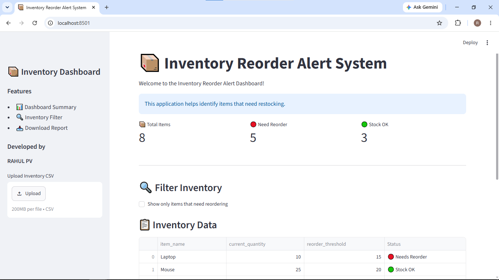
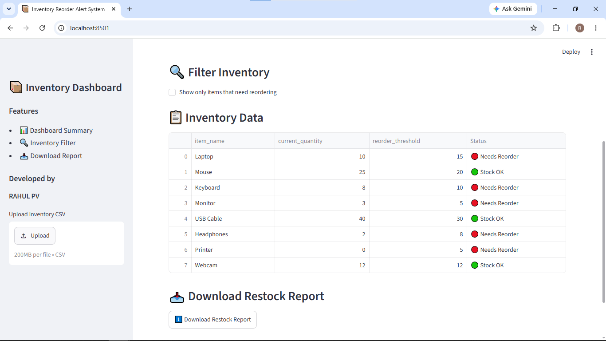
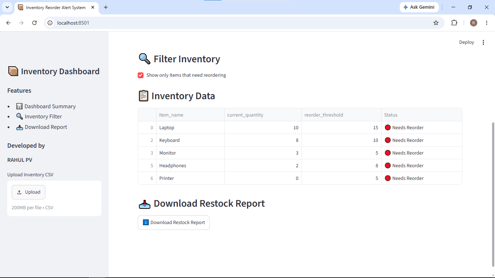

# 📦 Inventory Reorder Alert System

A simple Inventory Reorder Alert System built with **Python** and **Streamlit** that helps identify products requiring restocking based on predefined reorder thresholds.

---

## 🚀 Features

- 📂 Read inventory data from a CSV file
- 📊 Interactive Streamlit dashboard
- 📋 Display complete inventory in a table
- 🔴 Highlight items that need reordering
- 🔍 Filter to show only low-stock items
- 📥 Download the generated restock report as a CSV
- 📤 Upload a custom inventory CSV
- ⚠️ Basic exception handling for missing files

---

## 🛠️ Technologies Used

- Python 3
- Streamlit
- Pandas
- CSV Module
- Git & GitHub

---

## 📁 Project Structure

```text
Inventory-Reorder-Alert-System/
│
├── app.py
├── inventory_alert.py
├── inventory.csv
├── restock_report.csv
├── requirements.txt
├── img/
│   ├── screenshot1.png
│   ├── screenshot2.png
│   └── screenshot3.png
├── .gitignore
└── README.md
```

---

## 📸 Screenshots

### Dashboard



---

### Inventory Table



---

### Filter & Download Report



---

## ⚙️ Installation

### 1. Clone the repository

```bash
git clone https://github.com/RahulPV3/Inventory-Reorder-Alert-System.git
```

### 2. Navigate to the project folder

```bash
cd Inventory-Reorder-Alert-System
```

### 3. Install the required packages

```bash
pip install -r requirements.txt
```

---

## ▶️ Run the Application

```bash
streamlit run app.py
```

The application will automatically open in your default web browser.

---

## 📄 Sample Inventory

| Item | Current Quantity | Reorder Threshold | Status |
|------|-----------------:|------------------:|--------|
| Laptop | 10 | 15 | 🔴 Needs Reorder |
| Mouse | 25 | 20 | 🟢 Stock OK |
| Keyboard | 8 | 10 | 🔴 Needs Reorder |
| Monitor | 3 | 5 | 🔴 Needs Reorder |

---

## 📊 Dashboard Features

- 📦 Total inventory items
- 🔴 Number of items needing reorder
- 🟢 Number of items with sufficient stock
- 📋 Interactive inventory table
- 🔍 Filter only low-stock items
- 📥 Download restock report
- 📤 Upload a custom inventory CSV

---

## 📌 Future Improvements

- Database integration (SQLite/MySQL/PostgreSQL)
- User authentication
- Email alerts for low stock
- Add/Edit/Delete inventory items
- Charts and analytics dashboard
- Cloud deployment

---

## 👨‍💻 Author

**Rahul PV**

GitHub: [RahulPV3](https://github.com/RahulPV3)